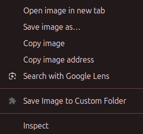

# One-Click Image Saver

No more right-clicking and saving images manually. Save images with one click only.

## Features
The default shortcut is "CTRL + ALT + LEFT CLICK" to save the image. This is customizable in the
extension settings. Alternatively, use the context menu to save the image when you right-click on it.

No ads, no tracking, no behind-the-scene snooping. Open source and free to use! Comments welcome.